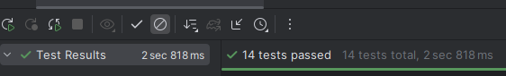
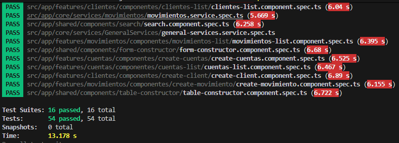
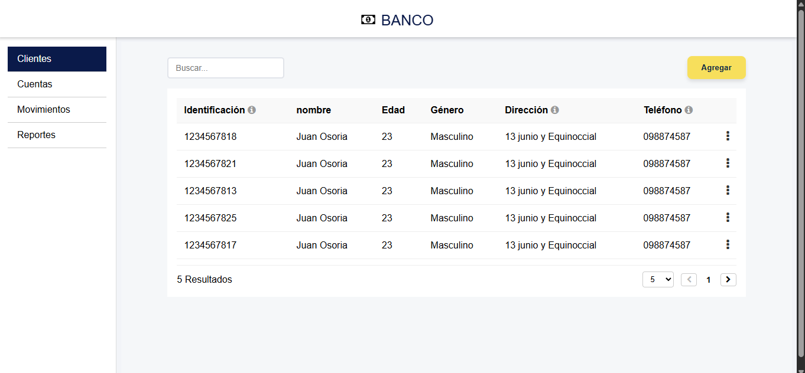
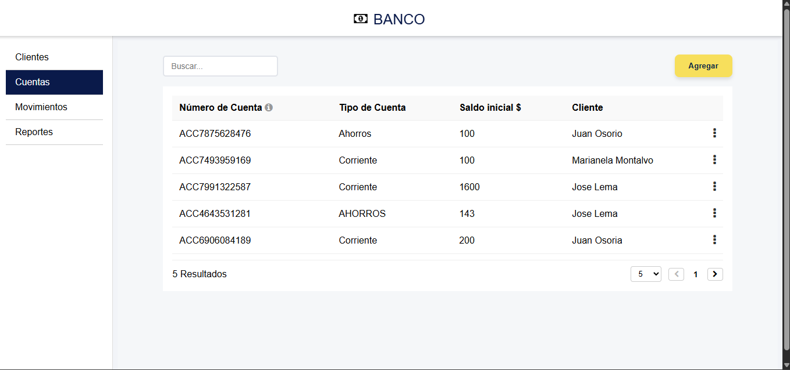
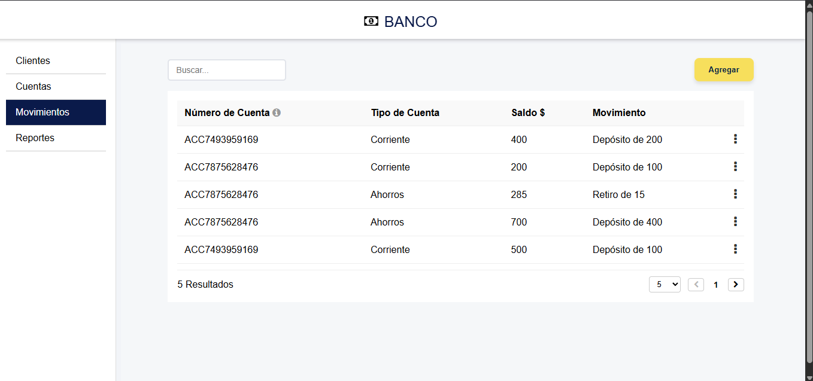
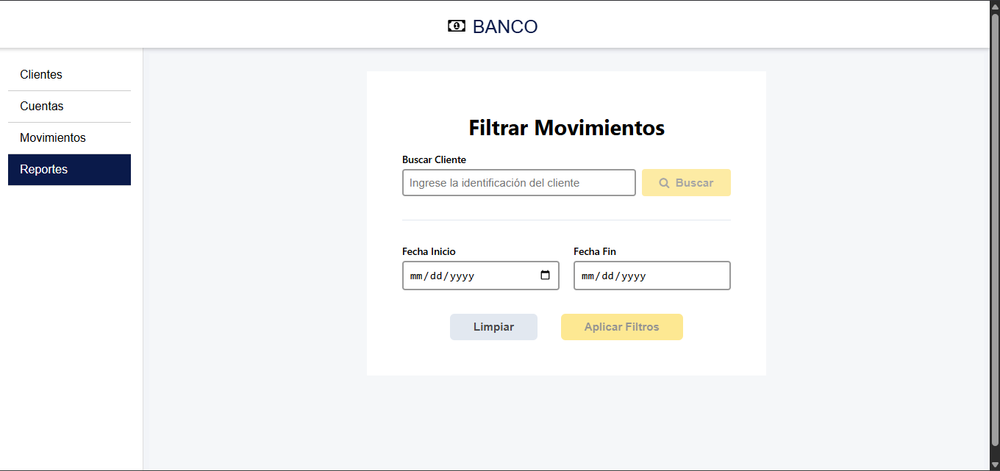

# NTTDATA – Reto Técnico Back-End & Front-End

<div style="display:flex; align-items:center; gap:12px">

</div>

Este repositorio contiene un **reto técnico para NTTDATA**, que incluye una arquitectura **back-end basada en microservicios con Spring Boot** y un **front-end desarrollado en Angular**.

El objetivo del proyecto es demostrar buenas prácticas de desarrollo, separación de responsabilidades, pruebas unitarias y uso de contenedores.

---

## 🛠️ Tecnologías Utilizadas

### Back-end

- Java 21
- Spring Boot
- Spring Data JPA
- Spring Cloud OpenFeign
- PostgreSQL
- Maven
- JUnit 5 + Mockito

### Front-end

- Angular
- TypeScript
- RxJS
- Jest (pruebas unitarias)

### DevOps / Otros

- Docker & Docker Compose
- Git

---

## 📋 Requisitos Previos

Antes de ejecutar el proyecto, asegúrate de tener instalado:

- Java 21 o superior
- Maven 3.6+
- Node.js 18+
- Angular CLI
- PostgreSQL
- Docker y Docker Compose
- IDE (IntelliJ IDEA, VSCode, etc.)

---

## 🗄️ Base de Datos

Antes de levantar los servicios:

1. Crear una base de datos PostgreSQL.
2. Ejecutar el script:

```bash
BaseDatos.sql
```

Este script:

- Crea la base de datos **nttdb**
- Genera el usuario y credenciales
- Crea tablas y relaciones
- Deja lista la estructura para que el back-end se conecte correctamente

---

## 🚀 Back-end

El back-end está compuesto por **dos microservicios desarrollados con Spring Boot**, ubicados en la carpeta:

```bash
/Backend
```

### ▶️ Levantar los microservicios

Desde la **raíz del repositorio**, ejecutar:

```bash
docker compose -f docker-composer.yml up -d
```

Este comando:

- Levanta ambos microservicios
- Conecta los servicios a la base de datos PostgreSQL
- Expone los endpoints necesarios para el front-end sin necesidad de entrar en un ambiente de desarrollo backend

### Ejecución de servicios

Para visulizar todos los servicios que existen en ambos microfronts se puede usar la colección nttdata test.postman_collection.json

### 🧪 Pruebas unitarias Back-end

Cada microservicio incluye pruebas unitarias desarrolladas con:

- JUnit 5
- Mockito

Para ejecutarlas:

```bash
mvn test
```



---

## 🌐 Front-end

El front-end se encuentra en la carpeta:

```bash
/Frontend
```

Es una aplicación **Angular** que consume los microservicios del back-end.

### ▶️ Ejecutar en desarrollo

```bash
npm install
ng serve
```

La aplicación se levantará en:

```bash
http://localhost:4200
```

### 📱 Pantallas Disponibles

- Gestión de Clientes
- Gestión de Cuentas
- Movimientos
- Reportes

### 🧪 Pruebas unitarias Front-end

El proyecto utiliza **Jest** para pruebas unitarias.

```bash
npm run test
```



---

## 📸 Ejemplos de la Aplicación






---

## 👤 Autor

**Adrian Rafael Bastidas Moya**

- GitHub: [@Adrian-Bastidas](https://github.com/Adrian-Bastidas)
- LinkedIn: [Adrian Rafael Bastidas Moya](https://www.linkedin.com/in/adrian-rafael-bastidas-moya-5b940419b/)
- Facebook: [Adrian Bastidas](https://www.facebook.com/rafdrian/)

---

📌 _Proyecto desarrollado como reto técnico para NTTDATA._
